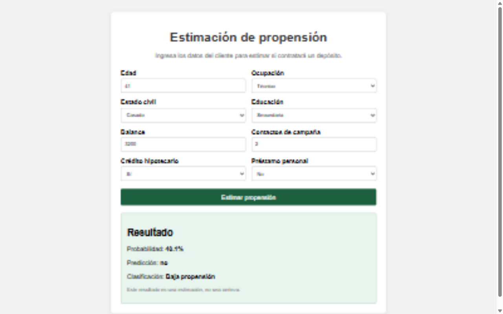

# Sistema de inferencia con Regresión Logística

Este proyecto estima si un cliente podría contratar un depósito a plazo.

El flujo es el siguiente:

```text
Frontend -> API -> Pipeline -> Regresión Logística -> Resultado
```

El resultado es solamente una estimación del modelo, no una certeza.

## Archivos principales

```text
data/bank.csv                         Dataset
training/train.py                     Entrenamiento
models/bank_marketing_pipeline.joblib Modelo guardado
models/metrics.json                   Métricas
app/main.py                           API
app/schemas.py                        Validación de datos
app/inference.py                      Predicción
frontend/index.html                   Estructura del frontend
frontend/styles.css                  Estilos del frontend
frontend/app.js                      Llamada a la API
tests/                                Pruebas
evidence/                             Evidencias
```

## Dataset

Se utilizó el dataset Bank Marketing de UCI:

https://archive.ics.uci.edu/dataset/222/bank+marketing

El archivo `data/bank.csv` ya está incluido en el proyecto.

Las variables usadas son:

- `age`
- `job`
- `marital`
- `education`
- `balance`
- `housing`
- `loan`
- `campaign`

La variable que se intenta predecir es `y`.

No se usa `duration` porque la duración de la llamada solo se conoce después de
contactar al cliente.

## Instalación

Se recomienda usar Python 3.12.

```powershell
py -3.12 -m venv .venv
.\.venv\Scripts\python.exe -m pip install -r requirements.txt
```

## Entrenar el modelo

El modelo ya está guardado, pero se puede volver a entrenar con:

```powershell
.\.venv\Scripts\python.exe -m training.train
```

El entrenamiento hace lo siguiente:

1. Lee el dataset.
2. Separa los datos de entrenamiento y prueba.
3. Escala las variables numéricas.
4. Convierte las variables categóricas con OneHotEncoder.
5. Entrena una Regresión Logística.
6. Guarda todo el pipeline con Joblib.

## Métricas obtenidas

| Métrica | Resultado |
|---|---:|
| Accuracy | 0.6099 |
| Precision | 0.1608 |
| Recall | 0.5673 |
| F1-score | 0.2505 |

El dataset tiene muchos más casos `no` que `yes`. Por eso se usó
`class_weight="balanced"`.

- Accuracy indica cuántas predicciones totales fueron correctas.
- Precision indica cuántos de los clientes marcados como `yes` realmente eran `yes`.
- Recall indica cuántos clientes `yes` logró encontrar el modelo.
- F1-score combina precision y recall.

El modelo es básico y todavía comete varios errores, pero sirve para mostrar el
flujo completo de inferencia.

## Ejecutar la aplicación

```powershell
.\.venv\Scripts\python.exe -m uvicorn app.main:app --reload
```

Después se puede abrir:

- Frontend: http://127.0.0.1:8000
- Documentación de la API: http://127.0.0.1:8000/docs

## API

El endpoint utilizado es:

```text
POST /predict
```

Ejemplo de solicitud:

```json
{
  "age": 41,
  "job": "technician",
  "marital": "married",
  "education": "secondary",
  "balance": 3200,
  "housing": "yes",
  "loan": "no",
  "campaign": 2
}
```

Ejemplo de respuesta:

```json
{
  "prediction": "no",
  "probability": 0.4009,
  "classification": "Baja propensión"
}
```

La probabilidad siempre corresponde a la clase `yes`.

## Validación de errores

La API rechaza datos incorrectos con el código HTTP `422`.

Ejemplos:

```json
{ "age": "hola" }
```

```json
{ "age": -10 }
```

El primer caso tiene un tipo incorrecto y el segundo está fuera del rango
permitido de 18 a 100 años.

## Evidencia

- Inferencia válida: [evidence/valid_prediction.json](evidence/valid_prediction.json)
- Error por tipo: [evidence/invalid_type_prediction.json](evidence/invalid_type_prediction.json)
- Error por rango: [evidence/invalid_range_prediction.json](evidence/invalid_range_prediction.json)

El frontend envía los datos a `/predict` y muestra la respuesta recibida:



## Pruebas

```powershell
.\.venv\Scripts\python.exe -m pytest -q
```

## Preguntas

### ¿Por qué el modelo se entrena fuera de la API?

Porque entrenar toma más tiempo. La API solo carga el modelo guardado y lo usa
para responder rápidamente.

### ¿Por qué se debe usar el mismo preprocesamiento?

Porque el modelo fue entrenado con datos escalados y variables categóricas
convertidas. Si la API los transforma de otra forma, la predicción puede ser
incorrecta.

### ¿Cuál es la diferencia entre `predict()` y `predict_proba()`?

`predict()` devuelve `yes` o `no`. `predict_proba()` devuelve la probabilidad de
cada clase.

### ¿Qué significa una probabilidad de 0.72?

Significa que el modelo estima una probabilidad de 72 % para la clase `yes`. No
significa que el cliente vaya a contratar con seguridad ni que el modelo tenga
72 % de accuracy.

### ¿Por qué no se usa `duration`?

Porque ese dato se conoce después de la llamada. El sistema quiere hacer la
estimación antes de contactar al cliente.

### ¿Qué pasa si cambia la información enviada por el frontend?

La API puede rechazar la solicitud si faltan campos o tienen otro tipo. Si se
cambian las variables del modelo, también se debe actualizar el entrenamiento y
volver a guardar el pipeline.
